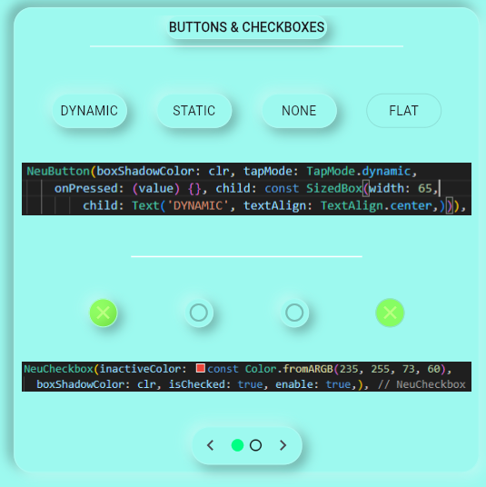
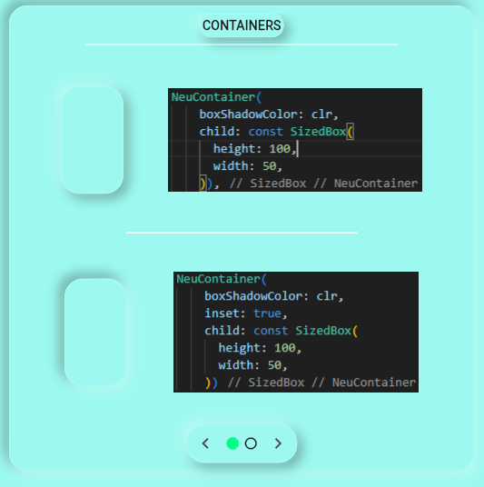
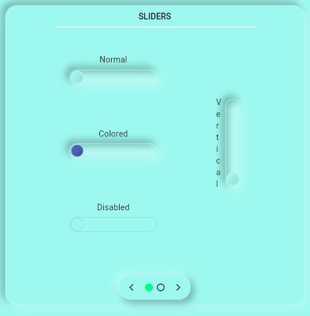
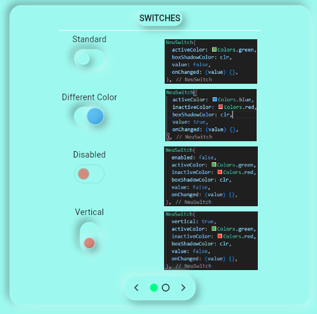

# Neumorphic Widgets

This package provides a set of neumorphic design widgets for Flutter. Neumorphism is a design trend that combines aspects of both flat design and skeuomorphism. This package makes it easy to incorporate this design style into your Flutter apps.

## Features

- NeuAppBar: A neumorphic design app bar.

- NeuButton: A neumorphic design button.

- NeuCheckbox: A neumorphic design checkbox.
- NeuContainer: A neumorphic design container.

- NeuSlider: A neumorphic design slider.

- NeuSwitch: A neumorphic design switch.


## Getting Started

To use this package, add `neumorphism_widgets` as a [dependency in your pubspec.yaml file](https://flutter.dev/docs/development/packages-and-plugins/using-packages).

## Demo App

To see all the widgets in action, check out the demo app. You can find the source code for the demo app in this [GitHub repository](https://github.com/yourusername/neumorphism_widgets_demo).

To run the demo app:

1. Clone the repository: `git clone https://github.com/yourusername/neumorphism_widgets_demo.git`
2. Navigate into the project directory: `cd neumorphism_widgets_demo`
3. Get the Flutter packages: `flutter pub get`
4. Run the app: `flutter run`

## Usage

Here is an example of how to use the widgets and their options:

`NeuButton`, a neumorphic button:

```dart
NeuButton(
  onPressed: (isTap) {
    print('NeuButton pressed. isTap: $isTap');
  }, // relatively the same as a standard on pressed
  child: Text('NeuButton'), // required for buttons
  boxShadowColor: Colors.grey[500]!, // the color of the shadows, set it as the parent widget color
  tapMode: TapMode.dynamic, // tapmode is the animation for the button.
  enabled: true, // controlls the onPressed.
)
`NeuContainer` is a neumorphic design container. Here is a simple example of using `NeuContainer`:

```dart
NeuContainer(
  onPressed: () {
    print('NeuContainer pressed');
  },// relatively the same as a standard on pressed
  child: Text('NeuContainer'), // widgets you want to have inside the container
  boxShadowColor: Colors.grey[500]!, // the color of the shadows, set it as the parent widget color
  radius: 15,
  shape: BoxShape.rectangle, // can be set to circle or rectangle, defaults to rectangle
  padding: EdgeInsets.all(10), // the padding around the child widgets in the container
  tapMode: TapMode.dynamic, // tapmode is the animation for the button, defaults to none
)

And here is an example of using `NeuSwitch`:

```dart
NeuSwitch(
  onChanged: (value) {
    print('NeuSwitch value: $value');
  }, // same as standard on changed
  value: false, 
  boxShadow: Colors.grey[500]!,
  enabled: true,
)

And here is an example of using `NeuAppBar`:

```dart
NeuAppBar(
  isScrolled: ValueNotifier<bool>(false),
  boxShadowColor: Colors.grey[500]!,
  title: Text('NeuAppBar'),
  leading: Icon(Icons.menu),
  centerTitle: true,
  actions: <Widget>[
    IconButton(
      icon: Icon(Icons.search),
      onPressed: () {
        print('Search button pressed');
      },
    ),
  ],
)

And here is an example of using `NeuSlider`:

```dart
NeuSlider(
  onChanged: (value) {
    print('NeuSlider value: $value');
  },
  value: 50,
  boxShadow: Colors.grey[500]!,
  enabled: true,
  length: 200,
  width: 30,
)


And here is an example of using `NeuCheckbox`:

```dart
NeuCheckbox(
  boxShadowColor: Colors.grey[500]!,
  isChecked: false,
  activeColor: Colors.green,
  enable: true,
)